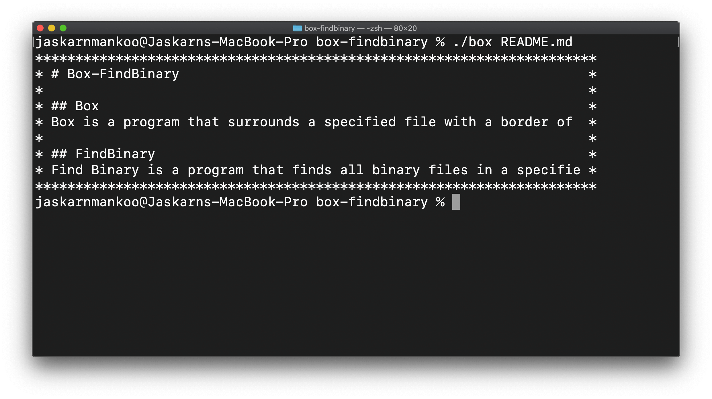
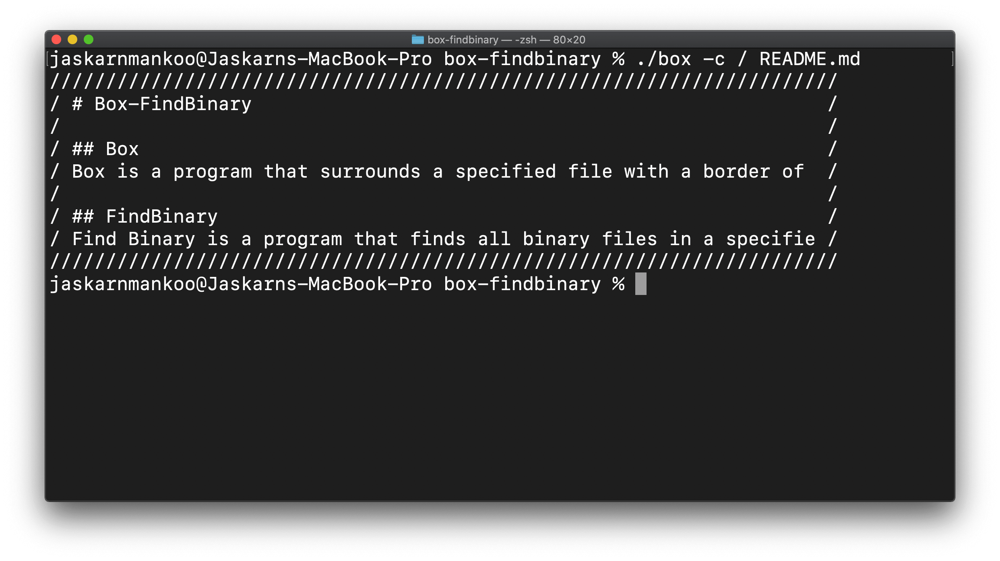
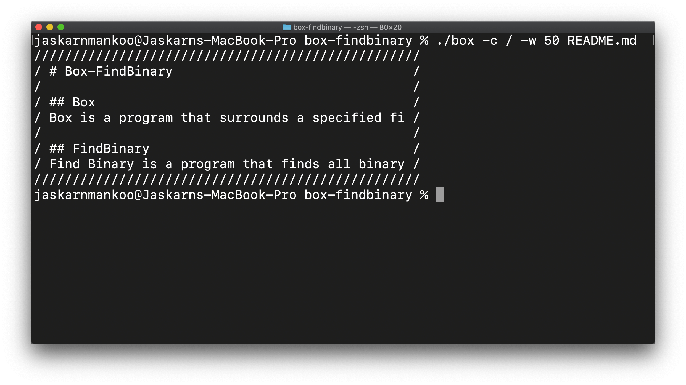
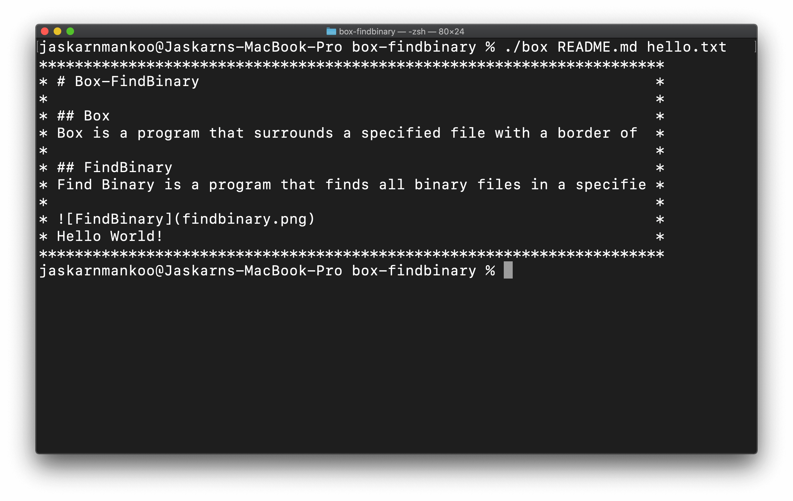
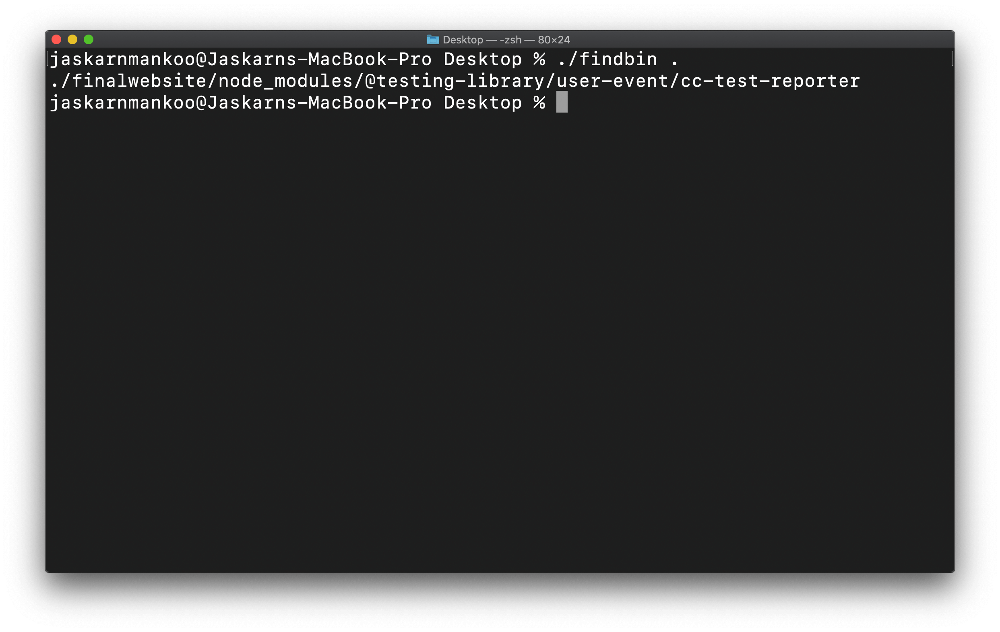

# box-findbinary

## Box
Box is a program that surrounds a specified file with a border of **"*"** characters. The user can specify multiple files at once, the character to create the box with, and modify the box's width.

* [Box](#execution-without-any-flags)
* [Box -c Flag](#execution-with--c-character-flag)
* [Box -c -w Flags](#execution-with--c-character-and--w-width-flag)
* [Box Multiple Files](#execution-on-multiple-files)

### Execution without any flags

### Execution with -c (character) flag

### Execution with -c (character) and -w (width) flag

### Execution on multiple files

## FindBinary
FindBinary is a program that finds all binary files in a specified directory.

### Execution

