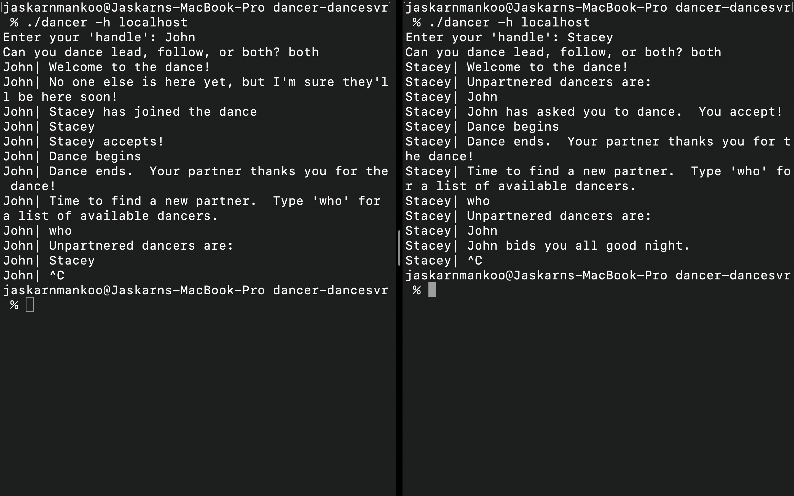
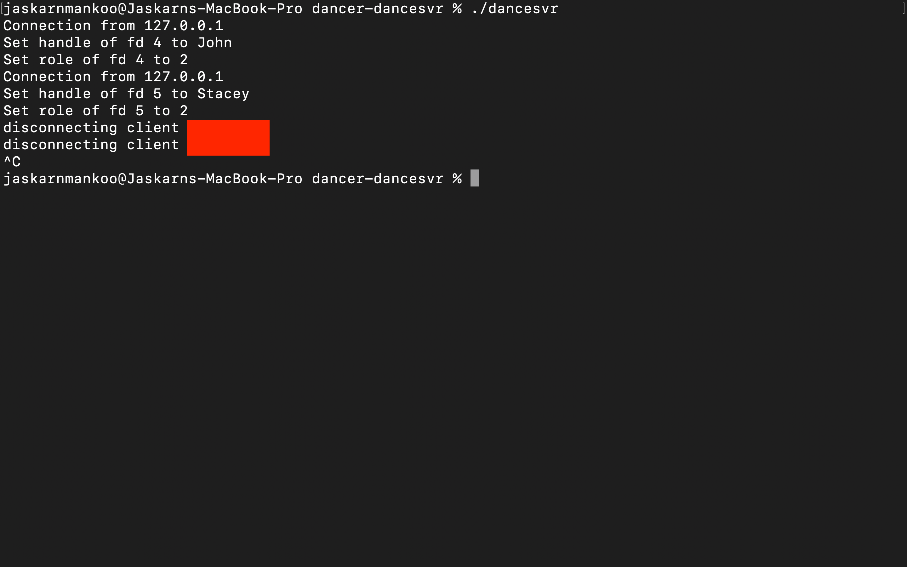

# dancer-dancesvr

An individual project that creates a dance hall server using sockets. Only dancers are allowed to connect to this server and pair up with other dancers. Actions such as requesting dances, dancing, and leaving can all be performed.

## Execution of Clients

## Execution of Server

